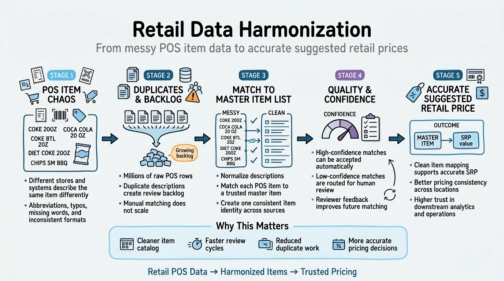
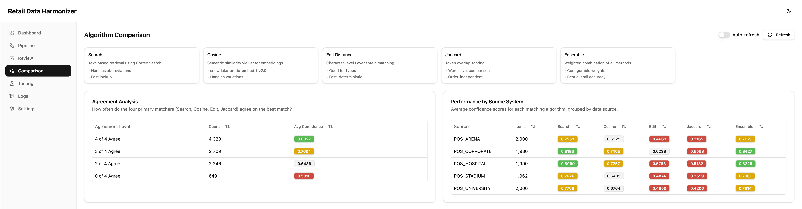
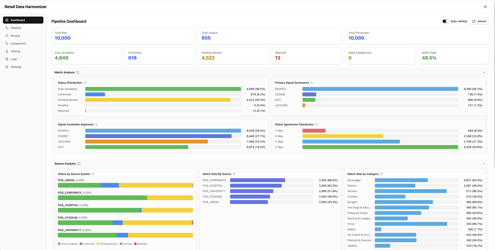

# Retail Data Harmonizer

[](https://opensource.org/license/apache-2-0)


[](https://www.python.org/downloads/)

**Automated retail item matching using Snowflake Cortex AI**

Map unmapped retail item descriptions to a master item list using four AI matching algorithms running in parallel with ensemble scoring.

## Built With

[](https://github.com/astral-sh/uv)
[](https://github.com/astral-sh/ruff)
[](https://github.com/astral-sh/ty)
[](https://react.dev/)
[](https://vite.dev/)
[](https://ui.shadcn.com/)


## Table of Contents

- [Built With](#built-with)
- [The Problem](#the-problem)
- [How It Works](#how-it-works)
- [Quick Start](#quick-start)
- [Architecture](#architecture)
- [Matching Pipeline](#matching-pipeline)
- [Web Interfaces](#web-interfaces)
- [CLI Reference](#cli-reference)
- [Configuration](#configuration)
- [Scheduled Execution](#scheduled-execution)
- [Accuracy Testing](#accuracy-testing)
- [Cost Tracking & ROI](#cost-tracking--roi)
- [Development](#development)
- [Make Commands](#make-commands)
- [Technical Requirements](#technical-requirements)


## The Problem

Retail data is messy in exactly the way that breaks elegant solutions.

Point-of-sale systems from Micros, Clover, NCR, and dozens of other vendors all use their own conventions. Operators abbreviate differently. Descriptions get truncated. Word order changes. A single 20oz Coca-Cola bottle might show up as:

- `COKE 20OZ BTL`
- `Coca-Cola Classic 20 oz`
- `20 OZ COCA COLA`
- `coke bottle (20oz)`
- `CK CLA 20OZ BTL`

Traditional approaches all fail in predictable ways:

- **Manual mapping** is expensive, inconsistent, and non-compounding -- every analyst builds slightly different heuristics, and when someone leaves, the knowledge walks out the door
- **Rule libraries** turn into operational debt -- every new edge case means another exception in a decision tree nobody fully understands
- **Single-model approaches** help, but every method has blind spots -- a pure embedding model handles paraphrases well but misses domain-specific abbreviations; a lexical matcher catches token overlap but fails when phrasing changes

This is why an ensemble approach works: different methods cover each other's weaknesses, and human review improves the economics over time instead of cleaning up the same mess repeatedly.

## How It Works



Four Snowflake Cortex AI matching methods run in parallel and combine into a ensemble score:

| Method | Function | Score Source |
|--------|----------|--------------|
| **Cortex Search** | Cortex Search Service | `@scores.cosine_similarity` normalized from [-1,1] to [0,1] |
| **Cosine Similarity** | `EMBED_TEXT_1024` + `VECTOR_COSINE_SIMILARITY` | Direct similarity score, typically [0,1] for text |
| **Edit Distance** | `EDITDISTANCE` | `1 - (distance / max_length)`, range [0,1] |
| **Jaccard Similarity** | Token intersection/union | `|A ∩ B| / |A ∪ B|` on word tokens, range [0,1] |

The ensemble score uses a **normalized 4-signal weighted average with agreement multipliers**:

```
-- Weights are normalized to sum to 1.0 at runtime
base_score = (0.55 × cortex_search) + (0.25 × cosine) + (0.12 × edit_distance) + (0.18 × jaccard)
ensemble_score = LEAST(1.0, base_score × agreement_multiplier - subcategory_penalty)
```

Where:
- **Weight Normalization**: Weights are dynamically normalized so base_score can reach 1.0
- **Agreement Multipliers**: 4-way = 1.20×, 3-way = 1.15×, 2-way = 1.10×
- **Subcategory Penalty** = -0.15 for mismatch, -0.05 for unknown (when subcategory classification is available)

**Two-Phase Classification:** Items are classified first by Category (using `AI_CLASSIFY`), then by Subcategory within that category. This enables subcategory-filtered matching and penalties for cross-subcategory matches.

**Routing:**
- Score >= 80%: Auto-accepted
- Score 70-79%: Auto-accepted (reviewable)
- Score < 70%: Routed for human review

Two cost optimizations run before any AI matching:

1. **De-duplication** — Collapse raw items to unique normalized descriptions (96x reduction on demo data)
2. **Fast-path cache** — Skip AI entirely for descriptions previously confirmed by a human reviewer


## Quick Start

### Prerequisites

- Python 3.11+
- [uv](https://docs.astral.sh/uv/) package manager
- [Snowflake CLI](https://docs.snowflake.com/en/developer-guide/snowflake-cli/index) (`snow`)
- Snowflake account with Cortex AI enabled (supported region)
- Connection configured in `~/.snowflake/connections.toml`

### Setup

```bash
# Clone the repository
git clone <repo-url>
cd retail_data_harmonizer

# Install dependencies
uv sync

# Deploy everything: database, tables, seed data, procedures
uv run demo setup
# Or use Make:
make setup
```

This creates the `HARMONIZER_DEMO` database with three schemas (`RAW`, `HARMONIZED`, `ANALYTICS`) and loads ~1,000 standard items and ~12,000 raw items.

### Run the Pipeline

The pipeline runs via a **Snowflake Task DAG** that processes items automatically:

```bash
# Enable Task DAG and trigger immediate execution
uv run demo data run

# Enable tasks only (waits for 3-minute schedule)
uv run demo data run --no-trigger

# Stop pipeline (disable tasks)
uv run demo data stop

# Check status
uv run demo data status
```

The Task DAG provides:
- **Parallel execution**: Cortex Search, Cosine, Edit Distance, and Jaccard run simultaneously
- **Dedup-first**: 651 unique descriptions processed instead of 9,960 raw items (15x reduction)
- **Stream-based processing**: Exactly-once semantics via `RAW_ITEMS_STREAM`
- **Classification step**: `AI_CLASSIFY` category + subcategory before matching
- **Automatic scheduling**: Runs every 3 minutes when enabled
- **Disconnection-resilient**: Continues even if CLI disconnects

Check task status:
```sql
CALL HARMONIZED.GET_PIPELINE_STATUS();
```

### Open the Web UI

**React Frontend** (local):
```bash
uv run demo api serve          # Start FastAPI backend on :8000
cd frontend/react && npm run dev  # Start React frontend on :5173
```

### Teardown

```bash
# Remove all database objects
uv run demo teardown
```


## Architecture

```ascii
HARMONIZER_DEMO Database
├── RAW Schema
│   ├── STANDARD_ITEMS          ~500 master items with SRP
│   ├── RAW_RETAIL_ITEMS        ~1,000 unmapped vendor items (includes INFERRED_SUBCATEGORY)
│   ├── STANDARD_ITEMS_EMBEDDINGS   Pre-computed 1024-dim vectors
│   └── CATEGORY_TAXONOMY       Configurable category/subcategory hierarchy
│
├── HARMONIZED Schema
│   ├── ITEM_MATCHES            Match results with ensemble scores (includes JACCARD_SCORE)
│   ├── MATCH_CANDIDATES        Top-N candidates per method
│   ├── UNIQUE_DESCRIPTIONS     De-duplicated normalized descriptions
│   ├── CONFIRMED_MATCHES       Fast-path cache with subcategory support
│   ├── TASK_COORDINATION       Table-based task coordination (message queue)
│   ├── RAW_ITEMS_STREAM        Stream for exactly-once processing
│   ├── STREAM_STAGING          Safe batch buffer (prevents data loss)
│   ├── CORTEX_SEARCH_STAGING   Staging table for parallel vector matching
│   ├── COSINE_MATCH_STAGING    Staging table for parallel vector matching
│   ├── EDIT_MATCH_STAGING      Staging table for parallel vector matching
│   ├── JACCARD_MATCH_STAGING   Staging table for parallel Jaccard matching
│   ├── PIPELINE_BATCH_STATE    Persistent batch coordination for Task DAG
│   ├── V_CURRENT_DAG_RUN       View: current DAG execution status
│   ├── V_DAG_RUN_HISTORY       View: aggregated DAG run history
│   └── V_TASK_COORDINATION_LATEST  View: latest status per task
│
└── ANALYTICS Schema
    ├── MATCH_AUDIT_LOG         Review history and feedback
    ├── CONFIG            Runtime configuration (weights, thresholds, models)
    ├── PIPELINE_RUNS           Run history and status
    ├── ACCURACY_TEST_JOBS      Accuracy test job tracking
    ├── CLASSIFICATION_JOBS     Classification job tracking
    ├── COST_TRACKING           Per-run cost metrics
    ├── V_COST_COMPARISON       Weekly cost trends view
    └── V_PIPELINE_HEALTH       Operational status view

```

### Unified Job Tracking Framework

Long-running operations use a consistent job tracking pattern:

| Job Type | Table | Key Procedures |
|----------|-------|----------------|
| Accuracy Testing | `ACCURACY_TEST_JOBS` | `START_ACCURACY_TEST_JOB`, `UPDATE_ACCURACY_TEST_PROGRESS` |
| Classification | `CLASSIFICATION_JOBS` | `START_CLASSIFICATION_JOB`, `UPDATE_CLASSIFICATION_PROGRESS` |

### Cortex AI Functions

| Function | Usage |
|----------|-------|
| `AI_CLASSIFY` | Category pre-filter — reduces cosine computation ~75% |
| `AI_SIMILARITY` | Direct text similarity (algorithm comparison page) |
| `EMBED_TEXT_1024` | Generate 1024-dim embeddings for cosine matching |
| `VECTOR_COSINE_SIMILARITY` | Score pre-computed embedding vectors |
| Cortex Search Service | Managed vector search index on standard items |


## Matching Pipeline

The pipeline runs as a **10-task Snowflake Task DAG** with TRUE parallel matching and a **decoupled ensemble**:

```
DEDUP_FASTPATH_TASK (root, scheduled every 3 min)
  └─> CLASSIFY_UNIQUE_TASK    ← AI_CLASSIFY category + subcategory
        └─> VECTOR_PREP_TASK  ← embeddings + ITEM_MATCHES stubs
              ├─> CORTEX_SEARCH_TASK  (parallel)
              ├─> COSINE_MATCH_TASK   (parallel)
              ├─> EDIT_MATCH_TASK     (parallel)
              └─> JACCARD_MATCH_TASK  (parallel)
                    └─> STAGING_MERGE_TASK (FINALIZE) ← merge staging tables
                          └─> ENSEMBLE_SCORING_TASK (WHEN) ← weighted ensemble
                          └─> ITEM_ROUTER_TASK (WHEN) ← route to final destinations
```

### De-duplication (DEDUP_FASTPATH_TASK)

Raw items are normalized (UPPER + TRIM + whitespace collapse) and merged into `UNIQUE_DESCRIPTIONS`. Results fan back to all raw items via `RAW_TO_UNIQUE_MAP`. On the included demo data, this collapses ~10,000 raw items to ~650 unique descriptions (93% reduction).

### Classification (CLASSIFY_UNIQUE_TASK)

Runs `CLASSIFY_UNIQUE_DESCRIPTIONS()` which uses `AI_CLASSIFY` for two-phase classification (category first, then subcategory within category) operating at the unique-description level. Results fan back to all raw items via `RAW_TO_UNIQUE_MAP`. This reduces the cosine similarity search space by ~75%.

### Fast-Path Cache (inside DEDUP_FASTPATH_TASK)

When a reviewer confirms a match, the description-to-standard-item mapping is cached in `CONFIRMED_MATCHES`. On subsequent pipeline runs, any raw item matching a cached description skips AI entirely and gets an instant, zero-cost match with `IS_CACHED = TRUE`.

### Decoupled Ensemble Pipeline

The ensemble pipeline is split into 3 single-responsibility tasks:

| Task | Trigger | Responsibility |
|------|---------|----------------|
| `STAGING_MERGE_TASK` | FINALIZE | Merge 4 staging tables into ITEM_MATCHES |
| `ENSEMBLE_SCORING_TASK` | WHEN (items ready) | Weighted ensemble scoring with agreement multipliers |
| `ITEM_ROUTER_TASK` | WHEN (items scored) | Route to HARMONIZED_ITEMS or REVIEW_QUEUE |

**Benefits:**
- Each task does exactly one thing (easier to troubleshoot/optimize)
- Self-healing via WHEN clauses (no orphan states)
- Independent batch limits per responsibility
- Clear state visibility in ITEM_MATCHES columns

### Ensemble Scoring



Each method produces a score. The ensemble combines them with configurable weights and applies agreement bonuses:

- All 4 vector signals agree (4-way): 20% boost (capped at 1.0)
- 3 signals agree: 15% boost
- 2 signals agree: 10% boost

Results are routed based on configurable thresholds stored in `CONFIG`.


## Web Interfaces

### React Web Application



Web UI for the retail data harmonizer:

- Built with React 19 + TypeScript + Vite + shadcn/ui + Tailwind CSS 4
- TanStack Query for server state, Zustand for client state
- Seven features: Dashboard, Pipeline, Review Matches, Algorithm Comparison, Test Verification, Logs, Settings
- Start with `uv run demo api serve` (backend) and `cd frontend/react && npm run dev` (frontend)

**Dashboard** — KPI cards (total items, match rate, auto-accept rate, avg confidence), status distribution chart, cost & ROI metrics. Includes a 60-second auto-refresh toggle.

**Pipeline** — Task DAG status and controls. Enable/disable tasks, view task states, monitor processing progress. Task execution history is available on the Logs page.

**Review Matches** — Filter by status, source system, category, sub category (dependent on category selection), and agreement level. The Agreement column displays as "X-way: Y%" (e.g., "4-way: 20%", "3-way: 15%", "2-way: 10%"). Confirm, reject, or skip matches. Pick alternative standard items. Thumbs up/down feedback. Record locking prevents concurrent edits (15-minute timeout with auto-expiry).

**Algorithm Comparison** — Side-by-side method agreement analysis, per-source-system performance breakdown, live `AI_SIMILARITY` calculator for ad-hoc text comparison.

**Logs** — Pipeline execution logs with RUN_ID to correlate related steps, STARTED_AT/COMPLETED_AT timestamps for precise timing, method performance metrics, error tracking with query IDs, and audit trail. Sortable and filterable by step, status, and category.

**Settings** — Adjust ensemble weights, acceptance/review thresholds, batch size, automation schedule, taxonomy viewer, cost configuration.


## CLI Reference

All commands use `uv run demo` as the entry point.

### Top-Level Commands

| Command | Description |
|---------|-------------|
| `uv run demo setup` | Full setup: database, tables, seed data, procedures |
| `uv run demo teardown` | Remove all database objects |
| `uv run demo status` | Show database status and row counts |
| `uv run demo validate` | Check environment and Snowflake connection |
| `uv run demo api serve` | Start FastAPI backend on port 8000 |

### Data Commands

The pipeline runs via a **Task DAG** for true parallel execution. Target latency: **<5 minutes** end-to-end.

| Command | Description |
|---------|-------------|
| `uv run demo data status` | Match status breakdown by category |
| `uv run demo data run` | Enable Task DAG and trigger immediate execution |
| `uv run demo data run --no-trigger` | Enable tasks only (wait for schedule) |
| `uv run demo data stop` | Disable Task DAG (stop automatic processing) |
| `uv run demo data reset` | Reset pipeline results (truncate matches) |
| `uv run demo data ingest` | Generate and ingest additional synthetic items |

**Performance Metrics** (500 items per batch):
| Stage | Duration | Notes |
|-------|----------|-------|
| Prep (classify + embed) | ~40s | Set-based SQL |
| Cortex Search | ~2m | Optimized bulk INSERTs |
| Cosine Match | ~3s | Set-based SQL (parallel) |
| Edit Match | ~3s | Set-based SQL (parallel) |
| Jaccard Match | ~3s | Set-based SQL (parallel) |
| Ensemble | ~20s | 4-method weighted scoring |
| **Total** | **~3 minutes** | Target: <5 min |

### Database Commands

| Command | Description |
|---------|-------------|
| `uv run demo db up` | Full database setup (all SQL files in dependency order) |
| `uv run demo db down` | Remove all database objects (database, warehouse, role) |
| `uv run demo db verify` | Verify database setup (row counts for all tables) |
| `uv run demo db run <file>` | Run a specific SQL file from `sql/` (e.g., `04_taxonomy.sql`) |


## Configuration

Runtime configuration is stored in `ANALYTICS.CONFIG`, a unified configuration table with categories. All keys are UPPER_CASE.

### Table Schema

```sql
CONFIG (
    CONFIG_KEY     VARCHAR(100) PRIMARY KEY,
    CONFIG_VALUE   VARCHAR(1000),
    DATA_TYPE      VARCHAR(20),    -- STRING, NUMBER, BOOLEAN
    CATEGORY       VARCHAR(50),    -- THRESHOLD, SCORING, MODEL, BATCH, etc.
    DESCRIPTION    VARCHAR(500),
    IS_ACTIVE      BOOLEAN,
    UPDATED_AT     TIMESTAMP_NTZ
)
```

**Helper Function**: `SELECT ANALYTICS.GET_CONFIG('AUTO_ACCEPT_THRESHOLD');`

### Matching Weights & Thresholds (SCORING, THRESHOLD)

| Key | Default | Description |
|-----|---------|-------------|
| `ENSEMBLE_WEIGHT_SEARCH` | 0.55 | Cortex Search weight (normalized at runtime) |
| `ENSEMBLE_WEIGHT_COSINE` | 0.25 | Cosine similarity weight (normalized at runtime) |
| `ENSEMBLE_WEIGHT_EDIT` | 0.12 | Edit distance weight (normalized at runtime) |
| `ENSEMBLE_WEIGHT_JACCARD` | 0.18 | Jaccard token similarity weight (normalized at runtime) |
| `AUTO_ACCEPT_THRESHOLD` | 0.80 | Score for automatic acceptance |
| `REVIEW_THRESHOLD` | 0.70 | Score threshold for review routing |
| `MIN_CANDIDATE_SCORE` | 0.50 | Minimum candidate inclusion score |

### Early Exit Configuration (EARLY_EXIT, AGREEMENT)

| Key | Default | Description |
|-----|---------|-------------|
| `AGREEMENT_MULTIPLIER_4WAY` | 1.20 | Score boost when all 4 signals agree |
| `AGREEMENT_MULTIPLIER_3WAY` | 1.15 | Score boost when 3 vector methods agree |
| `AGREEMENT_MULTIPLIER_2WAY` | 1.10 | Score boost when 2 vector methods agree |

### Models & Processing (MODEL, BATCH)

| Key | Default | Description |
|-----|---------|-------------|
| `EMBEDDING_MODEL` | snowflake-arctic-embed-l-v2.0 | Embedding model |
| `CLASSIFICATION_MODEL` | mistral-large2 | Model for AI_CLASSIFY category classification |
| `MAX_CANDIDATES` | 10 | Max candidates per method |
| `DEFAULT_BATCH_SIZE` | 200 | Items per pipeline batch |
| `BATCH_SIZE_CORTEX_SEARCH` | 500 | Items per Cortex Search batch |
| `BATCH_SIZE_COSINE` | 500 | Items per cosine similarity batch |

### Parallelism Configuration (PARALLELISM)

| Key | Default | Description |
|-----|---------|-------------|
| `CORTEX_PARALLEL_THREADS` | 4 | Max concurrent Cortex Search API threads (1-6) |
| `PIPELINE_PARALLELISM_MODE` | PARALLEL | Pipeline execution mode: SERIAL or PARALLEL |

### Retry Configuration (RETRY)

| Key | Default | Description |
|-----|---------|-------------|
| `MAX_RETRY_COUNT` | 3 | Maximum retry attempts for transient failures |
| `RETRY_BASE_DELAY_MS` | 1000 | Base delay in milliseconds for exponential backoff |
| `RETRY_MAX_DELAY_MS` | 30000 | Maximum delay in milliseconds for exponential backoff |

### Review & Locking (GENERAL)

| Key | Default | Description |
|-----|---------|-------------|
| `LOCK_TIMEOUT_MINUTES` | 15 | Minutes before review lock expires |

### Cost & Automation (GENERAL, DASHBOARD)

| Key | Default | Description |
|-----|---------|-------------|
| `CREDIT_RATE_USD` | 3.00 | USD per Snowflake credit |
| `BASELINE_WEEKLY_COST` | 16000 | Manual process weekly cost |
| `BASELINE_ACCURACY` | 0.75 | Manual process accuracy |
| `AGENTIC_ENABLED` | false | Enable automated daily runs |
| `AGENTIC_SCHEDULE` | 0 6 * * * | Cron schedule for automated runs |
| `DASHBOARD_AUTO_REFRESH` | off | Enable automatic dashboard refresh |
| `DASHBOARD_REFRESH_INTERVAL` | 300 | Seconds between dashboard auto-refresh |
| `NOTIFICATIONS_ENABLED` | false | Enable email notifications after pipeline runs |
| `NOTIFICATION_THRESHOLD` | 50 | Minimum PENDING_REVIEW items to trigger notification |
| `NOTIFICATION_RECIPIENTS` | (empty) | Comma-separated email addresses for notifications |

Update settings via the Settings page in either web UI, or directly:

```sql
-- Update a config value
CALL ANALYTICS.UPDATE_CONFIG('AUTO_ACCEPT_THRESHOLD', '0.80');

-- Query config using helper function
SELECT ANALYTICS.GET_CONFIG('ENSEMBLE_WEIGHT_SEARCH');

-- View all active config by category
SELECT * FROM ANALYTICS.V_APP_CONFIG WHERE CATEGORY = 'PARALLELISM';
```


## Scheduled Execution

For production deployments, use Snowflake Tasks instead of the CLI. The parallel Task DAG provides automated processing:

### Scheduled Tasks

| Task | Predecessor | Description |
|------|-------------|-------------|
| `DEDUP_FASTPATH_TASK` | Root (every 3 min) | Dedup raw items → UNIQUE_DESCRIPTIONS + fast-path resolution |
| `CLASSIFY_UNIQUE_TASK` | DEDUP (when != skipped) | AI_CLASSIFY category + subcategory at unique-description level |
| `VECTOR_PREP_TASK` | CLASSIFY (when != error) | Consume stream, generate embeddings, create ITEM_MATCHES stubs |
| `CORTEX_SEARCH_TASK` | VECTOR_PREP | Cortex Search matching → CORTEX_SEARCH_STAGING |
| `COSINE_MATCH_TASK` | VECTOR_PREP | Cosine similarity matching → COSINE_MATCH_STAGING |
| `EDIT_MATCH_TASK` | VECTOR_PREP | Edit distance matching → EDIT_MATCH_STAGING |
| `JACCARD_MATCH_TASK` | VECTOR_PREP | Jaccard token matching → JACCARD_MATCH_STAGING |
| **Decoupled Ensemble** | | |
| `STAGING_MERGE_TASK` | All 4 siblings (FINALIZE) | Merge staging tables into ITEM_MATCHES |
| `ENSEMBLE_SCORING_TASK` | WHEN (items ready) | Weighted ensemble scoring with agreement multipliers |
| `ITEM_ROUTER_TASK` | WHEN (items scored) | Route to HARMONIZED_ITEMS or REVIEW_QUEUE |

### Enable/Disable Tasks

```sql
-- Enable the parallel Task DAG (recommended for production)
CALL HARMONIZED.ENABLE_PARALLEL_PIPELINE_TASKS();

-- Disable all parallel tasks
CALL HARMONIZED.DISABLE_PARALLEL_PIPELINE_TASKS();

-- Check task status
CALL HARMONIZED.GET_PIPELINE_STATUS();
```

### Monitor Task Execution

```sql
-- View task execution history (last 7 days)
SELECT * FROM ANALYTICS.V_TASK_EXECUTION_HISTORY;

-- Refresh and view current task states
CALL HARMONIZED.REFRESH_PIPELINE_TASK_STATUS();
SELECT * FROM HARMONIZED.V_PIPELINE_TASK_STATUS;
```

### Parallel Task DAG Architecture

The parallel Task DAG runs **method-level matching concurrently** using Snowflake streams and staging tables:

```ascii
RAW_ITEMS_STREAM (exactly-once processing)
    │
    ▼
DEDUP_FASTPATH_TASK (root, runs on 3-min schedule)
    │   ─ Deduplicates raw items (96x cost reduction)
    │   ─ Resolves fast-path matches (zero AI cost)
    │
    ▼
CLASSIFY_UNIQUE_TASK (after DEDUP_FASTPATH)
    │   ─ AI_CLASSIFY category + subcategory
    │   ─ Fan-out via RAW_TO_UNIQUE_MAP
    │
    ▼
VECTOR_PREP_TASK (after CLASSIFY_UNIQUE)
    │   ─ Stages ALL stream items → STREAM_STAGING
    │   ─ Batches from staging (prevents data loss)
    │   ─ Generates embeddings
    │
    ├─► CORTEX_SEARCH_TASK  ─┬─► CORTEX_SEARCH_STAGING
    ├─► COSINE_MATCH_TASK   ─┼─► COSINE_MATCH_STAGING    (TRUE PARALLEL)
    ├─► EDIT_MATCH_TASK     ─┼─► EDIT_MATCH_STAGING
    └─► JACCARD_MATCH_TASK  ─┴─► JACCARD_MATCH_STAGING
                │
                ▼
    STAGING_MERGE_TASK (FINALIZE)
        ─ Merges 4 staging tables → ITEM_MATCHES
                │
    ┌───────────┴───────────┐
    ▼                       ▼
ENSEMBLE          ITEM_ROUTER
_SCORING          _TASK
_TASK             (WHEN)
(WHEN)
─ Weighted        ─ Route to
  scoring           destinations
─ Self-loop       ─ Self-loop
```

**Key Features:**
- **Stream-based**: `RAW_ITEMS_STREAM` provides exactly-once processing semantics
- **Safe batching**: Stream items staged first to `STREAM_STAGING` to prevent data loss with LIMIT
- **Scheduled execution**: Task runs every 3 minutes; procedure handles empty states gracefully
- **No table locking**: Each method writes to its own TRANSIENT staging table
- **Self-healing**: WHEN clauses enable tasks to self-trigger when work is available
- **No orphan states**: Each item has a clear next step at all times


## Monitoring & Observability

The pipeline includes comprehensive observability features for production monitoring.

### Real-Time Pipeline Status

```sql
-- Current pipeline status with ETA
SELECT * FROM ANALYTICS.V_PIPELINE_STATUS_REALTIME;

-- Columns: RUN_ID, PIPELINE_STATUS, CURRENT_STEP, ITEMS_PROCESSED, ITEMS_PENDING,
--          THROUGHPUT_PER_MINUTE, ESTIMATED_MINUTES_REMAINING
```

### Performance Metrics

```sql
-- Historical performance (last 30 days)
SELECT * FROM ANALYTICS.V_PIPELINE_PERFORMANCE_HISTORY;

-- Method accuracy comparison (Cortex Search vs Cosine vs Edit Distance vs Jaccard)
SELECT * FROM ANALYTICS.V_METHOD_ACCURACY_COMPARISON;

-- Agreement-based scoring effectiveness
SELECT * FROM ANALYTICS.V_OPTIMIZATION_METRICS;
```

### Error Investigation

```sql
-- Error summary (last 30 days)
SELECT * FROM ANALYTICS.V_PIPELINE_ERRORS_ANALYSIS;

-- Recent errors with full context
SELECT * FROM ANALYTICS.V_RECENT_ERRORS;
```

### Native Snowflake Telemetry

The pipeline integrates with Snowflake's native Event Table for distributed tracing and observability.

**Configuration** (per-database telemetry levels):
```sql
-- View current telemetry configuration
SHOW PARAMETERS LIKE 'LOG_LEVEL' IN DATABASE HARMONIZER_DEMO;

-- Configure telemetry levels
CALL ANALYTICS.CONFIGURE_TELEMETRY('INFO', 'ON_EVENT', 'ALL');
-- Parameters: LOG_LEVEL, TRACE_LEVEL, METRIC_LEVEL
```

**Native Telemetry Views**:
```sql
-- Native Event Table logs (last 7 days)
SELECT * FROM ANALYTICS.V_NATIVE_EVENT_LOGS;

-- Native trace spans with duration
SELECT * FROM ANALYTICS.V_NATIVE_TRACES;

-- Native system metrics (CPU, memory)
SELECT * FROM ANALYTICS.V_NATIVE_METRICS;

-- Combined view: custom logs + native telemetry via TRACE_ID
SELECT * FROM ANALYTICS.V_COMBINED_OBSERVABILITY;

-- End-to-end trace correlation
SELECT * FROM ANALYTICS.V_TRACE_CORRELATION;
```

**Cortex AI Credit Tracking**:
```sql
-- Daily Cortex credit consumption by service type
SELECT * FROM ANALYTICS.V_CORTEX_CREDIT_CONSUMPTION;

-- Token usage by Cortex function
SELECT * FROM ANALYTICS.V_CORTEX_TOKEN_USAGE;
```

**Python SDK Integration**: The FastAPI application uses `snowflake-telemetry-python` to create spans automatically for all API endpoints and database queries. Spans are correlated via TRACE_ID with native Snowflake telemetry.

### CLI Status Command

The `demo data status` command shows observability metrics:

```bash
uv run demo data status
# Shows: row counts, match status, pipeline performance (24h),
#        early exit stats, and active alerts
```


## Accuracy Testing

The pipeline includes a rigorous accuracy testing framework to validate matching quality against a ground truth test set. This ensures the demo meets the **>85% accuracy target** before production deployment.

### Why Accuracy Testing Matters

- **Validates algorithm performance** — Each method (Cortex Search, Cosine, Edit Distance, Jaccard) is tested independently
- **Ensures demo readiness** — Pass/fail validation against the 85% target
- **Identifies failure patterns** — Detailed analysis of incorrect matches by difficulty level
- **Supports tuning decisions** — Empirical data to guide weight adjustments

### Test Set Design

The test set includes 38 curated test cases across three difficulty levels:

| Difficulty | Examples | Challenge |
|------------|----------|-----------|
| **EASY** (7) | "Coca-Cola 20oz" → "Coca-Cola Classic 20oz Bottle" | Near-exact matches |
| **MEDIUM** (13) | "MT DEW 20OZ BTL" → "Mountain Dew 20oz Bottle" | Common abbreviations |
| **HARD** (18) | "CK ZERO 20 BTL" → "Coca-Cola Zero Sugar 20oz Bottle" | Heavy abbreviation, ambiguous |

### Running Accuracy Tests

> **Note:** Accuracy tests are designed for manual triggering only (no scheduled task). Use the commands below or the UI to run tests on demand.

```bash
# Create accuracy testing objects (included in demo setup)
uv run demo db accuracy

# Or run via SQL after setup
CALL ANALYTICS.RUN_ACCURACY_TESTS(TRUE);  -- All 4 methods: Cortex Search, Cosine, Edit, Jaccard
```

### Viewing Results

```sql
-- Overall accuracy by method
SELECT * FROM ANALYTICS.V_ACCURACY_SUMMARY;

-- Accuracy broken down by difficulty (EASY/MEDIUM/HARD)
SELECT * FROM ANALYTICS.V_ACCURACY_BY_DIFFICULTY;

-- Pass/fail check against 85% target
SELECT * FROM ANALYTICS.V_DEMO_VALIDATION;

-- Detailed failure analysis
SELECT * FROM ANALYTICS.V_ACCURACY_FAILURES;
```

### Sample Output

```ascii
┌─────────────────────┬─────────────┬──────────────────┬──────────────────┐
│ METHOD              │ TOTAL_TESTS │ TOP1_ACCURACY_PCT│ TOP3_ACCURACY_PCT│
├─────────────────────┼─────────────┼──────────────────┼──────────────────┤
│ CORTEX_SEARCH       │ 38          │ 92.1             │ 97.4             │
│ COSINE_SIMILARITY   │ 38          │ 71.1             │ 86.8             │
│ EDIT_DISTANCE       │ 38          │ 44.7             │ 63.2             │
└─────────────────────┴─────────────┴──────────────────┴──────────────────┘
```

This data drove the weight adjustment: Cortex Search (0.50) receives the highest weight, followed by Cosine Similarity (0.30), because it handles abbreviated retail descriptions significantly better.


## Cost Tracking & ROI

Cost and ROI metrics are automatically derived from Snowflake system tables—no manual tracking required:

**Data Sources:**
- **Credits:** `SNOWFLAKE.ACCOUNT_USAGE.WAREHOUSE_METERING_HISTORY` (actual warehouse consumption)
- **Task Runs:** `SNOWFLAKE.ACCOUNT_USAGE.TASK_HISTORY` (completed Task DAG executions)
- **Items Processed:** `HARMONIZED.PIPELINE_BATCH_STATE` (completed batches with item counts)
- **Fast-Path Cache:** `HARMONIZED.CONFIRMED_MATCHES` (human-confirmed mappings that skip AI)

**Views:**
- **`V_COST_COMPARISON`** — Cumulative cost metrics: total credits, USD cost, cost per item, hours saved vs. baseline, ROI percentage
- **`V_PIPELINE_HEALTH`** — Operational metrics: throughput, error rates, fast-path hit rate

**KPI Formulas:**
- **Cost per Item:** `total_usd / total_items`
- **Hours Saved:** `(baseline_cost - actual_cost) / $50 hourly rate`
- **ROI %:** `((baseline - actual) / actual) × 100`

The dashboard derives cost and ROI metrics from Snowflake system tables, factoring in the de-duplication ratio and fast-path cache hit rate.


## Development

### Project Structure

```ascii
retail_data_harmonizer/
├── pyproject.toml                 # hatchling build, uv dependencies
├── Dockerfile                     # Container image for SPCS deployment
├── deploy_spcs.sh                 # SPCS deployment script
├── AGENTS.md                      # AI agent instructions
├── CHANGELOG.md                   # Project changelog
├── PROJECT.md                     # Project overview
├── docs/
│   └── ARCHITECTURE.md            # System architecture documentation
├── cli/                           # Typer CLI (entry point: demo = "cli:app")
│   ├── __init__.py
│   ├── config.py                  # Configuration management
│   ├── console.py                 # Rich console output
│   ├── snowflake.py               # Snowflake connection helpers
│   └── commands/                  # Subcommand groups
│       ├── api.py
│       ├── apps.py
│       ├── data.py
│       ├── db.py
│       └── web.py
├── backend/                       # Backend services
│   ├── __init__.py
│   ├── snowflake.py               # Shared Snowflake connection utilities
│   └── api/                       # FastAPI application
│       ├── __init__.py            # FastAPI app factory
│       ├── deps.py                # Dependency injection
│       ├── snowflake_client.py    # Snowflake query client
│       └── routes/                # API route modules
│           ├── comparison.py
│           ├── dashboard.py
│           ├── logs.py
│           ├── pipeline.py
│           ├── pricing.py
│           ├── review.py
│           ├── settings.py
│           └── testing.py
├── frontend/
│   └── react/                     # React/TypeScript frontend
│       ├── package.json
│       ├── vite.config.ts
│       ├── tsconfig.json
│       └── src/
│           ├── App.tsx
│           ├── main.tsx
│           ├── api/               # API client
│           ├── components/        # React components
│           ├── hooks/             # Custom hooks
│           └── types/             # TypeScript types
├── docker/                        # Container configurations
│   ├── Dockerfile.api             # API-only image
│   ├── Dockerfile.react           # React frontend image
│   ├── docker-compose.yml         # Multi-service orchestration
│   └── nginx.conf                 # Reverse proxy configuration
├── sql/
│   ├── setup/                     # SQL files (numbered execution order)
│   │   ├── 01_roles_and_warehouse.sql  # Database, warehouse, role, schemas
│   │   ├── 02_schema_and_tables.sql    # All table DDL
│   │   ├── 03_event_views.sql     # Event tables
│   │   ├── 04_telemetry.sql       # Pipeline execution logging
│   │   ├── 05_seed_data/          # Standard items + raw items (13 files)
│   │   ├── 06_category_taxonomy.sql    # Category taxonomy
│   │   ├── 07_raw_items_stream.sql     # RAW_ITEMS_STREAM creation
│   │   ├── 08_dedup_normalization.sql  # Text normalization rules
│   │   ├── 09_fastpath_cache.sql  # De-dup, fast-path cache
│   │   ├── 10_item_lineage.sql    # Item lineage tracking
│   │   ├── 11_matching/           # Core matching procedures
│   │   ├── 12_parallel_matchers.sql
│   │   ├── 13_admin_utilities.sql
│   │   ├── 14_cost_tracking.sql
│   │   ├── 15_task_coordination.sql # Task coordination table
│   │   ├── 16_task_dag_definition.sql  # Snowflake Tasks
│   │   ├── 17_reevaluation_triggers.sql
│   │   ├── 18_api_views.sql
│   │   ├── 19_materialized_aggregates.sql
│   │   ├── 20_accuracy_testing/   # Accuracy test framework
│   │   ├── 21_role_grants.sql
│   ├── apps/                      # Application deployment SQL
│   ├── teardown/
│   └── utils/
├── tests/                         # Test suite
└── plans/                         # PRD, implementation plans
```

### SQL Execution Order

Scripts are numbered to indicate dependency order. The CLI discovers and executes all `.sql` files recursively, including those in subdirectories:

```
01_roles_and_warehouse.sql Database, warehouse, role, schemas
02_schema_and_tables.sql   Core table definitions
03_event_views.sql         Event tables
04_telemetry.sql           Pipeline execution logging
05_seed_data/              Standard items + raw test data (15 files)
06_category_taxonomy.sql   Category taxonomy
07_raw_items_stream.sql    RAW_ITEMS_STREAM creation
08_dedup_normalization.sql Text normalization rules
09_fastpath_cache.sql      De-duplication, fast-path cache
10_item_lineage.sql        Item lineage tracking
11_matching/               Core matching procedures (4 files)
12_parallel_matchers.sql   Batch matching procedures
13_admin_utilities.sql     Utility stored procedures
14_cost_tracking.sql       Cost tracking tables and analytics views
15_task_coordination.sql   Task coordination table (message queue)
16_task_dag_definition.sql Snowflake Tasks for automation
17_reevaluation_triggers.sql Re-evaluation procedures
18_api_views.sql           Dashboard monitoring views
19_materialized_aggregates.sql Dynamic tables for dashboard KPIs
20_accuracy_testing/       Accuracy test framework (4 files)
21_role_grants.sql         Permission grants
```

> **Note:** Directories (marked with `/`) contain multiple files executed in alphabetical order (e.g., `05a_`, `05b_`, etc.).

Run `uv run demo db up` to execute all scripts in the correct order.

### Key Stored Procedures

| Procedure | Schema | Purpose |
|-----------|--------|---------|
| `RUN_MATCHING_PIPELINE` | HARMONIZED | Full pipeline orchestrator (serial - legacy) |
| `VECTOR_PREP_BATCH` | HARMONIZED | Stream consumer, classify, embed |
| `MATCH_CORTEX_SEARCH_BATCH` | HARMONIZED | Cortex Search to staging (parallel) |
| `MATCH_COSINE_BATCH` | HARMONIZED | Cosine similarity to staging (parallel) |
| `MATCH_EDIT_BATCH` | HARMONIZED | Edit distance to staging (parallel) |
| `COMPUTE_ENSEMBLE_SCORES_ONLY` | HARMONIZED | 4-method ensemble scoring |
| `COMPUTE_ENSEMBLE_WITH_NOTIFICATION` | HARMONIZED | Ensemble + notification (Task DAG finalizer) |
| `ENABLE_PARALLEL_PIPELINE_TASKS` | HARMONIZED | Enable Task DAG (correct dependency order) |
| `DISABLE_PARALLEL_PIPELINE_TASKS` | HARMONIZED | Disable Task DAG |
| `GET_PIPELINE_STATUS` | HARMONIZED | Current pipeline status for CLI/UI |
| `DEDUPLICATE_RAW_ITEMS` | HARMONIZED | Normalize and de-duplicate |
| `RESOLVE_FAST_PATH` | HARMONIZED | Fast-path cache lookup |
| `ACQUIRE_LOCK` | HARMONIZED | Review record locking |
| `RELEASE_LOCK` | HARMONIZED | Release review lock |
| `SUBMIT_REVIEW` | HARMONIZED | Process confirm/reject/feedback |
| `RESET_PIPELINE` | HARMONIZED | Truncate match results |
| `GET_PIPELINE_STATS` | ANALYTICS | Dashboard statistics |
| `LOG_PIPELINE_STEP` | ANALYTICS | Log step execution metrics |
| `RUN_ACCURACY_TESTS` | ANALYTICS | Run accuracy tests against ground truth |
| `MATCH_ITEMS_STREAM` | HARMONIZED | Stream-based single-pass matching |
| `FORCE_REEVALUATE_SCORES` | HARMONIZED | Force re-score existing matches |
| `RECOVER_ORPHANED_ITEMS` | HARMONIZED | Recovery for stuck items |


## Make Commands

The project includes a Makefile for common development tasks. Run `make` or `make help` to see all available commands.

### Quick Reference

| Command | Description |
|---------|-------------|
| `make setup` | Full demo setup (database + pipeline + seed data) |
| `make serve` | Start FastAPI web app on port 8000 |
| `make test` | Run all pytest tests |
| `make validate` | Run all validation checks (lint + test) |
| `make teardown` | Remove all database objects |

### All Commands by Category

**Environment:**
- `make env-sync` — Sync dependencies
- `make preflight` — Verify environment is ready

**Code Quality:**
- `make lint` / `make lint-fix` — Ruff linting
- `make format` / `make format-fix` — Ruff formatting
- `make quality-check` / `make quality-fix` — All quality checks

**Testing:**
- `make test` — Run pytest
- `make test-cov` — Coverage report
- `make test-cov-open` — Open HTML coverage in browser

**Database & SQL:**
- `make db-up` / `make db-down` — Database lifecycle
- `make db-verify` — Check table row counts
- `make sql-validate FILE=...` — Compile-check a SQL file

**Data Pipeline:**
- `make data-run` / `make data-stop` — Enable/disable Task DAG
- `make data-status` — Show match metrics
- `make data-reset` — Reset pipeline results

**Docker:**
- `make docker-build` — Build container image
- `make docker-run` — Run container locally
- `make docker-push REGISTRY=...` — Push to registry

**SPCS Deployment:**
- `make spcs-deploy` — Deploy to Snowpark Container Services
- `make spcs-status` / `make spcs-logs` — Monitor service

**Accuracy Testing:**
- `make accuracy-run` — Run accuracy tests
- `make accuracy-report` — View accuracy summary

### Snowflake Connection Override

Use `CONN=<name>` to specify a different Snowflake connection:

```bash
make setup CONN=myconn
make data-run CONN=prod
```


## Technical Requirements

| Requirement | Details |
|-------------|---------|
| Snowflake account | Cortex AI enabled, supported region |
| Python | 3.11+ |
| Package manager | uv |
| Snowflake CLI | `snow` command available |
| Connection | Configured in `~/.snowflake/connections.toml`